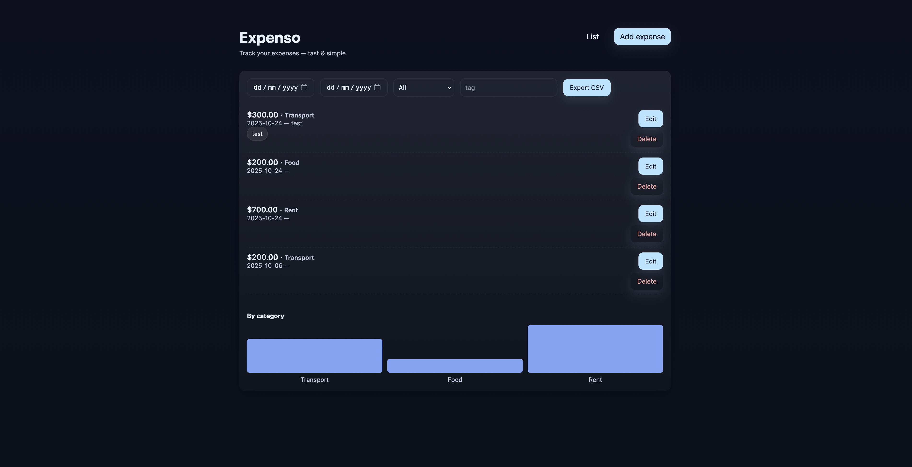

# Expenso (minimal)

A minimal Next.js expense tracker prototype.

This project was built for the Digital Science 2025 Technocly AI Hack Day as part of the Coders Track.

### Features
- Simple CRUD for expenses (amount, category, date, description, tags)
- List with filters (date range, category, tag)
- Export CSV
- Small SVG chart showing totals by category
- Local JSON persistence (optional) so data survives server restarts

### Run locally

```bash
cd expenso
npm install
npm run dev
```
Open http://localhost:3000

### Persistence
- By default the app persists expenses to `.data/expenses.json` (created automatically on first save).
- The `.data/` directory is ignored by git (see `.gitignore`). This solution is intended for local/dev use only.

### Styling and themes
- The app uses `styles/globals.css` with CSS variables for easy palette swapping.
- To change the palette, edit the `:root` variables in `styles/globals.css`. A "Soft Pastel Glass" theme is applied by default.

### Helpful commands
- Start dev server: `npm run dev`
- Build for production: `npm run build` and `npm run start`

### Screenshot



### License

This project is licensed under the MIT License — see the accompanying `LICENSE` file for details.


